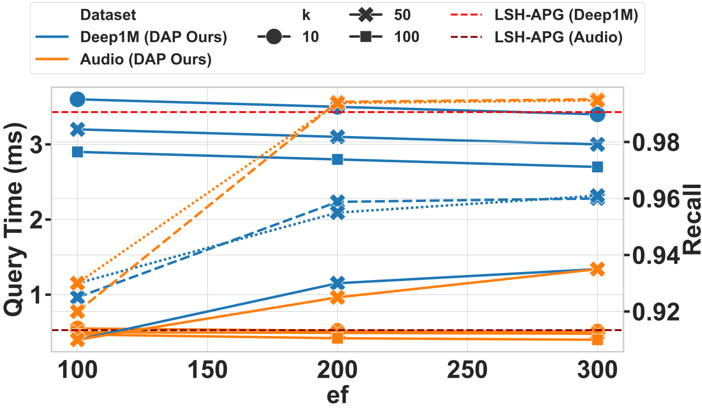

# DAPG: Distance-Aware Pruned Graph

> **Distance-Aware Pruning for Efficient Approximate Nearest Neighbor Search over Evolving Data**  
> 
---


<p align="center">
  <a href="https://students.washington.edu/solmazsm/"><strong>Solmaz Seyed Monir</strong></a>, 
  <a href="https://faculty.washington.edu/dzhao/"><strong>Dr. Dongfang Zhao</strong></a>,

</p>


<p align="center">
  <a href="https://solmazsm.github.io/Distance-Aware-Pruned-Graph/" target="_blank">
    
  </a>

  <a href="https://github.com/solmazsm/Distance-Aware-Pruned-Graph/">
    
  </a>
  
</p>  

<p align="center">
   <b>University of Washington</b>
</p>


---

## **ABSTRACT**

DAPG introduces percentile-based local filtering and adaptive global sparsification to build degree-adaptive proximity graphs that preserve reachability while reducing redundant edges.  
DAPG improves latency–recall trade-offs over **state-of-the-art (SOTA)** baselines without multi-layer indexing.

<p>
  <kbd>+3.3% recall</kbd>
  <kbd>2.9× faster</kbd>
  <kbd>Single layer</kbd>
  <kbd>LSH seeding</kbd>
</p>

---
## Why This Work

### What existing ANN methods miss and how **DAPG** addresses them

| Common gaps in existing ANN methods | How **DAPG** addresses them |
| :---------------------------------- | :--------------------------- |
| • **Fixed-degree graphs:** Static degree limits prevent density-aware sparsification. | **Adaptive sparsity:** Local percentile filtering and global capping balance recall and cost. |
| • **Costly rebuilds:** Traditional structures often require expensive repair or reconstruction under updates. | **Localized updates:** Insertions and deletions reapply pruning only to affected neighborhoods. |
| • **Uncontrolled expansion:** Greedy traversal may expand redundant nodes. | **Pruned search:** Traversal operates on a sparse, degree-controlled graph. |
| • **Weak theoretical support:** Prior heuristics often lack formal sparsity, query-cost, and recall-preservation analysis. | **Theory-backed design:** DAPG provides sparsity bounds, query-cost analysis, and conditional recall-preservation guarantees. |

> **Result:** DAPG improves the recall-latency trade-off, achieving up to **3.3% higher recall** and up to **2.9× lower query time**, while supporting localized update maintenance.

---
## Contributions

<table>
  <tr>
    <td width="48%" valign="top">

<strong>1) Theory</strong><br>
Formalizes distance-aware pruning and adaptive degree control in proximity graphs, providing sparsity bounds, query-cost analysis, update-cost analysis, and conditional recall-preservation guarantees.

  </td>
  <td width="48%" valign="top">

<strong>2) Method</strong><br>
DAPG introduces local percentile filtering (P<sub>local</sub>) and adaptive global capping (P<sub>global</sub>) to construct degree-adaptive graphs that reduce redundant edges while preserving neighborhood connectivity.

  </td>
  </tr>
  <tr>
  <td width="48%" valign="top">

<strong>3) Empirics</strong><br>
Evaluates DAPG on six datasets against representative static and update-aware ANN baselines, showing up to 3.3% higher recall and up to 2.9&times; lower query time.

  </td>
  <td width="48%" valign="top">

<strong>4) Updates</strong><br>
Supports localized insert/delete maintenance by reapplying pruning only to affected hash buckets, candidate neighborhoods, and adjacency lists, avoiding full-index reconstruction.

  </td>
  </tr>
</table>


## INTRODUCTION
This repository provides the source code for **DAPG**, a novel graph-based Approximate Nearest Neighbor (ANN) indexing system introduced in the paper.

---


## What DAPG Adds - DISTANCE-AWARE PRUNED GRAPH FRAMEWORK

**Distance-Aware Local Pruning (percentile threshold per node).**

**Adaptive Global Sparsification (cap high-degree tails.**

**Parallel construction with thread-safe updates.**

**Serialization of graph + LSH structures for fast reloads.**

---
## **Cost Model**

**Local percentile threshold  + adaptive cap <code>T'</code>.**
**LSH seeding; no hierarchy.**

**Supports dynamic insertion and deletion with degree-stable connectivity.**

Expected query cost factorizes into average degree and expansion depth.

<pre>
C_Q = O(&macr;d_DAPG · β(ℓ))
T_Q = O(d · &macr;d_DAPG · β(ℓ))
β(ℓ) = O(log n) under small-world routing
</pre>

**Cost model: <code>C<sub>Q</sub> = O(&macr;d<sub>DAPG</sub>&nbsp;β(ℓ))</code>.**

---


## Compilation

The code is implemented in **C++11** and supports parallelism using **OpenMP**. It can be compiled on both Linux and Windows.

### Linux

Linux (g++ / clang++)

Requires C++11 and OpenMP.

The provided Makefile auto-detects -fopenmp. If your toolchain differs, edit cppCode/DAPG/Makefile.

```bash
cd ./cppCode/DAPG
make
```

###  Windows

Use **Visual Studio 2019+** to import the project located in:

```
./cppCode/DAPG/src/
```

Make sure to enable OpenMP and C++11 support in the build settings.

## Running DAPG

### Command Format

```bash
./dapg datasetName
```

- `datasetName`: The name of the dataset (e.g., `sift`, `mnist`, `audio`)

### Example

```bash
cd ./cppCode/DAPG
./dapg sift
```

This runs DAPG index construction and search on the `sift` dataset.

## Key Features

-  Distance-Aware Local Pruning: Adapts edge filtering based on local percentile distances.
-  Sparsity Control: Limits node degree while preserving connectivity in sparse regions.
-  Improved Recall–Latency Tradeoff: Reduces query time without degrading recall.
-  Compatible with ANN frameworks.


  | Component / Feature | HNSW | LSH-APG | DAPG (Ours) |
|---|---|---|---|
| Graph structure | Multi-layer hierarchical proximity graph | Single-layer LSH-assisted proximity graph | Single-layer distance-aware pruned graph |
| Entry point | Entry point from upper graph layers | LSH-selected entry candidates | LSH-selected seed set with collision-aware multi-start |
| Neighbor selection | Heuristic neighbor selection with degree parameter `M` | LSH-assisted neighbor selection with pruning conditions | Node-local percentile threshold `τᵢ` with global cap `T′` |
| Pruning rule | Heuristic pruning to limit degree and preserve diversity | LSH-based pruning with fixed/global degree control | Local distance-aware pruning using node-specific thresholds |
| Adaptivity to density | Limited through heuristic neighbor selection | Limited because pruning is mainly global/static | High because `τᵢ` adapts to local distance distributions |
| Search algorithm | Greedy/best-first traversal with `efSearch` | LSH-seeded graph traversal on APG | LSH-seeded best-first traversal on the DAPG-pruned graph |
| Degree control | Controlled by `M` and `M_max` | Controlled by global caps and pruning conditions | Controlled by local percentile pruning and global cap `T′` |
| Index size | Higher due to multiple layers | Moderate | Similar to or lower than LSH-APG due to fewer redundant edges |
| Memory usage | Higher due to hierarchical layers | Lower than multi-layer graph methods | Similar to or lower than LSH-APG |
| Parameters exposed | `M`, `M_max`, `efConstruction`, `efSearch` | `K`, `L`, `T`, `T′`, `p`, `W` | `p`, `T′`, LSH parameters, seed size `s`, and query budget `ef` |
| Navigability | Hierarchical small-world routing | Single-layer LSH-assisted traversal | Single-layer traversal with density-aware sparsification |
| Tuning sensitivity | Moderate | High because global parameters must be tuned | Lower because local thresholds adapt to neighborhood scale |
| Dense regions | May retain redundant local links | May over-connect or prune uniformly | Removes redundant dense-region edges using local thresholds |
| Sparse regions | Hierarchy can help long-range routing | May under-connect due to global pruning | Preserves broader connectivity through adaptive thresholds |
| Dynamic updates | Incremental insertion supported | Insert/delete maintenance supported | Localized insert/delete maintenance without full rebuilds |                                                                   |
| Method | Mode | Key point |
| **HNSW** | Incremental | Multi-layer graph with heuristic neighbor selection; high recall but higher memory. |
| **LSH-APG** | Incremental | LSH-assisted APG construction with update support; efficient but uses fixed/global pruning. |
| **DAPG (Ours)** | Batch + Dynamic | LSH-seeded graph with local percentile pruning and localized insert/delete maintenance. |


## Complexity and Efficiency Comparison

> **Lemma 3**, supported by **Lemma 2**, shows that DAPG achieves expected query complexity  
> **O(d̄<sub>DAPG</sub> β(ℓ))**, where the average degree is bounded by  
> **d̄<sub>DAPG</sub> ≤ min{p d̄<sub>LSH</sub>, T′}**.

DAPG improves efficiency by combining local percentile pruning with adaptive global sparsification. This reduces redundant edges, preserves graph reachability, and lowers traversal cost.

| Method | Build Complexity | Query Complexity | Notes |
|:-------|:----------------:|:----------------:|:------|
| HNSW | Õ(n log n · d̄<sub>HNSW</sub>) | O(L d̄ β(ℓ)) | Multi-layer graph; higher structural overhead |
| LSH-APG | O(nd C<sub>Q</sub>) + O(n d̄<sub>LSH</sub>) | O(d̄<sub>LSH</sub> β(ℓ)) | Fixed-degree pruning |
| **DAPG (Ours)** | O(nd C<sub>Q</sub>) + O(nk log k) + O(n d̄<sub>DAPG</sub>) | **O(d̄<sub>DAPG</sub> β(ℓ))** | Local percentile pruning + adaptive cap T′ |

**Key benefits:**

- Fewer redundant edges → faster traversal
- Adaptive pruning → lower average degree
- Single-layer graph → avoids multi-layer structural overhead
- Localized updates → no full index reconstruction
- Empirically: up to **2.9× faster** and **3.3% higher recall**
>
> ---
## EVALUATIONS

## Datasets

We support and have tested DAPG on:

- [Audio](https://github.com/RSIA-LIESMARS-WHU/LSHBOX-sample-data)
- [SIFT1M](http://corpus-texmex.irisa.fr/)
- [Deep1M](https://www.cse.cuhk.edu.hk/systems/hash/gqr/dataset/deep1M.tar.gz)
- [MNIST](http://yann.lecun.com/exdb/mnist/)
- [SIFT100M](http://corpus-texmex.irisa.fr/)
- [Text2Image1M](https://research.yandex.com/datasets)


Convert these into the `.data_new` format for compatibility.
## Dataset Format

The expected input format is a binary file containing float vectors, structured as:

```
{int: float size in bytes}
{int: number of vectors}
{int: dimension}
{float[]: all vector values, stored sequentially}
```

### Example: `sift.data_new`

To use your dataset:

1. Convert it into the binary format shown above.
2. Rename it as `[datasetName].data_new`
3. Place it in: `./dataset/`

A sample dataset (e.g., `audio.data_new`) is already provided.


## Dataset-Dependent Pruning Behavior

DAPG adapts each node’s pruning threshold `τᵢ` based on its local distance distribution. Compact, low-LID regions allow effective sparsification, while high-LID or heterogeneous regions require more conservative edge retention to preserve connectivity.

| Dataset | Geometry | LID | Pruning Behavior | Graph Size |
|---|---|---:|---|---|
| **Audio** | Uniform MFCC neighborhoods | 21.5 | Stable thresholds; consistent pruning | **Small** |
| **MNIST** | Clustered pixel manifold | 12.7 | Effective sparsification | **Small** |
| **Deep1M** | Heterogeneous cosine space | 26.0 | Conservative pruning | **Larger** |
| **SIFT1M** | Smooth L2 structure | 12.9 | Balanced pruning | **Medium** |
| **SIFT100M** | Large-scale smooth L2 structure | 23.7 | Effective pruning at scale | **Smaller** |
| **Text2Image1M** | Multimodal cosine space | 8.4† | Adaptive retention of cross-modal edges | **Medium/Larger** |

†The LID value for Text2Image1M is estimated on the available one-million-vector subset. 

## System Setup

Our experiments were conducted on both local and cloud-based environments to evaluate the efficiency and scalability of the DAPG system.

###  Local Workstation
- **Processor**: 13th Gen Intel® Core™ i9-13900HX (24 cores, 32 threads)
- **Base Frequency**: 2.2 GHz  
- **OS**: Ubuntu 20.04 LTS  
- **Precision**: `float32` for all vectors  
- **Implementation**: C++ with multi-threading via OpenMP  
- **Query Setup**: 104 queries per experiment, averaged over 5 independent runs

###  Microsoft Azure Virtual Machines

1. **Standard F32s v2**
   - **vCPUs**: 32  
   - **RAM**: 64 GiB  
   - **Dataset**: SIFT1M  
   - **Purpose**: Scalability evaluation

2. **Standard E64-32s v3 (High-Memory)**
   - **vCPUs**: 32 (Intel® Xeon® Platinum 8272CL)  
   - **RAM**: 432 GiB  
   - **Disk**: 1 TB Premium SSD  
   - **OS**: Ubuntu 22.04 LTS  
   - **Dataset**: SIFT100M  
   - **Purpose**: Large-scale indexing and ANN benchmarking

This high-memory configuration allowed for efficient scaling to large datasets, and multi-threaded execution ensured fast parallel processing during both index construction and query search.
 

#### Distance-Aware Pruning (DAP)
- Introduced a percentile-based thresholding mechanism.
- For each node, computed the 80th percentile distance (τ_q) over LSH candidates.
- Inserted only neighbors with `dist < τ_q` to ensure sparsity and relevance.
- Exposed `last_threshold` for optional diagnostics or debugging.


####  Parallel Construction
- Used `ParallelFor` to insert all nodes in parallel (except the first).
- Enabled thread safety via `std::shared_mutex` for concurrent graph updates.
- Fallbacks to `std::mutex` when C++17 is not available.

#### Serialization
- Graph (`linkLists`) and LSH hash tables are saved to and loaded from a binary format.
- Implemented in `save()` and the constructor `divGraph(Preprocess* prep, ...)`.

## Benchmark Logs

Each row logs detailed metrics:

- **Recall**: Top-k retrieval accuracy
- **Pruning**: Ratio of retained neighbors after DAP-based filtering
- **Time**, **Cost**, and additional performance indicators
- **Algorithm Name**: Includes pruning threshold information (e.g., `DAP_k10_th...`)


- The header includes configuration details such as:  
  `k=20, probQ=0.9, L=2, K=18, T=24`

Each row records:
- `algName`: algorithm configuration with pruning threshold
- `k`: number of neighbors
- `ef`: search parameter
- `Time`: average query time (ms)
- `Recall`: search recall
- `Cost`, `CPQ1`, `CPQ2`: computation cost metrics
- `Pruning`: pruning ratio applied

### Parameter Settings

We evaluate DAP (Distance-Aware Pruning) with:

- k=20, L=2, K=18, T=24, T′=48, W=1.0, pC=0.95, pQ=0.90, efC=80

  
**DAPG computes τ_q per node (default percentile = 80).**


DAP applies **local dynamic pruning**, computing a threshold `τ_q` per node.

---

We evaluate DAPG across a range of:

- `k ∈ {1, 10, 20, ..., 100}`
- `ef` values for query expansion

This allows robust analysis of recall and efficiency across diverse search settings

## Metrics
Each run logs:

Recall@k, Time(ms), Cost, CPQ*, Pruning(%)

algName encodes the pruning threshold (e.g., DAP_k10_th80)

Seed and environment are printed at the top for determinism.


## Results

### Performance Comparison between Reproduced LSH-APG and DAPG

| Metric | DEEP1M LSH-APG | DEEP1M DAPG | MNIST LSH-APG | MNIST DAPG | SIFT1M LSH-APG | SIFT1M DAPG |
|---|---:|---:|---:|---:|---:|---:|
| Recall | 0.9590 | **0.9632 ± 0.0057** | 0.9972 | **0.9984 ± 0.0010** | 0.9580 | **0.9870 ± 0.0025** |
| Query Time (ms) | 3.43 | **2.30 ± 0.20** | 0.682 | **0.560 ± 0.29** | 2.42 | **0.83 ± 0.00** |
| Index Size (MB) | 250 | 449 | 10 | 27.77 | 468 | **455** |
| Indexing Time (s) | 230.1 | **98.3–121.5** | 6.4 | **3.2–4.5** | 105 | **70–103** |
| Pruning Rate | 0.267 | **0.30–0.32** | 0.410 | **0.50–0.53** | 0.210 | **0.54–0.55** |

### Improvement over LSH-APG

| Dataset | Recall Improvement | Query-Time Improvement |
|---|---:|---:|
| DEEP1M | **+0.44%** | **32.9% faster** |
| MNIST | **+0.12%** | **17.9% faster** |
| SIFT1M | **+3.34%** | **65.6% faster** |

> DAPG consistently improves recall and reduces query latency compared with reproduced LSH-APG across DEEP1M, MNIST, and SIFT1M. DAPG also achieves higher pruning rates, indicating more effective distance-aware pruning and sparser graph construction.

---

### Fixed-`k` Comparison at `k = 50`

| Dataset | Method | Recall@10 | Query Time (ms) |
|---|---|---:|---:|
| DEEP1M | LSH-APG | 0.9590 | 3.43 |
| DEEP1M | **DAPG (Ours)** | **0.9615** | **2.30** |
| MNIST | LSH-APG | 0.9972 | 0.682 |
| MNIST | **DAPG (Ours)** | **0.9984** | **0.560** |
| SIFT1M | LSH-APG | 0.9580 | 2.42 |
| SIFT1M | **DAPG (Ours)** | **0.9738** | **0.921** |

| Dataset | Recall Improvement | Query-Time Improvement |
|---|---:|---:|
| DEEP1M | **+0.26%** | **32.9% faster** |
| MNIST | **+0.12%** | **17.9% faster** |
| SIFT1M | **+1.65%** | **62.0% faster** |

> At the fixed-`k = 50` setting, DAPG maintains higher recall while substantially reducing query time, especially on SIFT1M.

---

- DAPG applies distance-aware pruning, producing more effective and sparser graphs.
- LSH-APG values are reported at `k = 50`.
- DAPG spans `k = 10–100`.
- The larger DAPG index size on MNIST is due to denser graph construction.
- DAPG results at `k = 10` include 12-run mean ± standard deviation.

Performance comparison of DAPG vs. LSH-APG on DEEP1M, MNIST, and SIFT1M.
DAPG continues to achieve higher recall and lower query latency than LSH-APG across all datasets, demonstrating consistent scalability and efficiency gains at larger neighborhood sizes.
<table>
<tr>
<td>

<b>Results at k = 10</b>

| Dataset | Method | Recall@10 | Query Time (ms) | Index Size (MB) |
|----------|---------|------------|----------------|----------------|
| **DEEP1M** | LSH-APG | 0.9590 | 3.43 | 250 |
|  | **DAPG (Ours)** | **0.9632 ± 0.0057** | **2.30 ± 0.20** | **449** |
| **MNIST** | LSH-APG | 0.9972 | 0.682 | 10 |
|  | **DAPG (Ours)** | **0.9984 ± 0.0010** | **0.560 ± 0.290** | **27.77** |
| **SIFT1M** | LSH-APG | 0.9580 | 2.42 | 468 |
|  | **DAPG (Ours)** | **0.9870 ± 0.0025** | **0.83 ± 0.00** | **455** |

</td>
<td>

<b>Results at k = 50</b>

| Dataset | Method | Recall@50 | Query Time (ms) | Index Size (MB) |
|----------|---------|------------|----------------|----------------|
| **DEEP1M** | LSH-APG | 0.9590 | 3.43 | 250 |
|  | **DAPG (Ours)** | **0.9615 ± 0.0042** | **2.30 ± 0.22** | **449** |
| **MNIST** | LSH-APG | 0.9972 | 0.682 | 10 |
|  | **DAPG (Ours)** | **0.9984 ± 0.0010** | **0.560 ± 0.290** | **27.77** |
| **SIFT1M** | LSH-APG | 0.9580 | 2.42 | 468 |
|  | **DAPG (Ours)** | **0.9738 ± 0.0028** | **0.83 ± 0.00** | **455** |

</td>
</tr>
</table>


## DAPG is lightweight, efficient, and dynamically maintainable, outperforming hierarchical and refinement-based methods in both memory and build time.
### 1. Lightweight (memory-efficient)
> Figure 8 (Index Size):
> DAPG is much smaller on MNIST and SIFT100M, meaning the pruning is effective.
> Figure 8 (Indexing Time):
> DAPG builds faster than HNSW, NSG, and HCNNG, and is faster than LSH-APG on large datasets (DEEP1M, SIFT100M).
> This confirms that two-stage pruning does not increase construction overhead.
 ### 2. Efficient (fast query + fast build)
> Fast query: 
> **Figure 11 (SIFT100M)** demonstrates that DAPG achieves the lowest query latency (≈1.0–1.4 ms) and the highest recall across all k, outperforming all state-of-the-art ANN baselines.


> Fast build: Figure 8 shows that DAPG achieves faster index construction than hierarchical and refinement-based ANN methods, and consistently outperforms LSH-APG on large datasets (DEEP1M and SIFT100M).


> Query Time (DEEP1M):
> **Figure 10** and **Table 5 (Comparison of DAPG and fastG on DEEP1M)**,  
> **DAPG reduces query latency from ~3.4 ms (LSH-APG / fastG) to as low as ~1.3–1.5 ms, providing more than a 2× speedup while also achieving higher recall.**

### 3. Dynamically maintainable

> **Key Distinction: DAPG vs. LSH-APG**
>
> LSH-APG applies a fixed global degree cap **T′** in its construction procedure (Alg. 2), imposing a uniform degree bound that does not adapt to local geometric or statistical variation in the dataset.  
>  
> In contrast, **DAPG** derives a *node-wise*, data-adaptive threshold  
> τᵢ = Percentile_p { δ(vᵢ, vⱼ) ∣ vⱼ ∈ N(vᵢ) } 
> via the **LocalPrune** and **GlobalPrune** operators (Algs. 3–4), and uses this mechanism consistently throughout **DAPG-Index-Construction** (Algs. 1–2), **DAPG-Query** (Alg. 5), and **DAPG-Update** (Alg. 6).  
>  
> Because τᵢ is data-adaptive, DAPG preserves structurally essential neighbors in **high-LID** neighborhoods while performing strong sparsification on **low-LID** neighborhoods, providing higher recall, faster query times, and smaller index sizes than existing APG-based methods, particularly at large scale.


## Query Efficiency and Recall

As shown in **Figure 1**, DAPG consistently achieves lower query latency than LSH-APG across all evaluated datasets, while maintaining comparable or higher recall.

On **Deep1M** with `k = 100`, DAPG achieves a recall of **0.961** with a query time of **2.7 ms**, outperforming LSH-APG, which requires **3.43 ms** to reach similar recall.  
On the **Audio** dataset with `k = 50`, DAPG reaches a recall of **0.9951** in **0.48 ms**, compared to **0.528 ms** for the baseline.

Marker shapes correspond to different values of `k`, and **red dashed lines indicate baseline (LSH-APG) query times**. Overall, these results demonstrate that DAPG serves as an effective and lightweight refinement strategy, improving graph sparsity and query efficiency.

**Figure 1:** [View PDF](https://github.com/solmazsm/Distance-Aware-Pruned-Graph/blob/master/docs/result/figures/query_time_and_recall_vs_ef.pdf)

##  DAPG vs. LSH-APG (Recall–Latency)

As shown in **Figure 2 `dap_vs_lshapg`**, DAPG consistently outperforms the LSH-APG baseline across all neighborhood budgets (NB).  
For example, **DAPG_k=10** and **DAPG_k=20** achieve high recall (≈0.971) with substantially lower query times (**1.378 ms** and **1.508 ms**) than **LSH-APG**, which attains lower recall (<0.96) and higher latency (>1.6 ms).  
Even at larger budgets (**k = 50, 100**), DAPG maintains recall above **0.966** with competitive or improved latency. Overall, the best trade-off occurs at **k = 10**, where DAPG reaches **0.971 recall** at **1.378 ms** query time.

**Figure 2:** [View PDF](https://github.com/solmazsm/Distance-Aware-Pruned-Graph/blob/master/docs/result/figures/dap_vs_lshapg_comparison.pdf)

## DAPG vs. baselines deep1m and audio
Figure 3 further highlights DAPG’s strong performance over the baselines on **`Deep1M and Audio`**, achieving the highest recall@10 while also attaining the lowest query time. These results indicate that DAPG preserves high-quality neighbors while constructing sparse, navigable proximity graphs, and that its advantages are especially pronounced on heterogeneous datasets such as **`Audio`**.

**Figure 3:** [View PDF](https://github.com/solmazsm/Distance-Aware-Pruned-Graph/blob/master/docs/result/figures/dap_vs_baselines_deep1m_audio.pdf)


### Recall and Query-Time Analysis

<table>
  <tr>
    <td align="center">
      <br>
      <b>Recall and Query Time</b>
    </td>
    <td align="center">
      <br>
      <b>Indexing and Pruning</b>
    </td>
    <td align="center">
      <br>
      <b>Overall Comparison</b>
    </td>
  </tr>
</table>

<p align="center">
  <b>Figure:</b> Recall and query-time comparison between DAPG and reproduced LSH-APG across different `ef` and `k` settings.
 As shown in Figure~\ref{fig:query_time_and_recall_vs_ef}, DAPG consistently achieves lower query latency than LSH-APG across all datasets, while maintaining comparable or higher recall. On \textsc{Deep1M} at $k{=}100$, DAPG attains a recall of 0.961 with a query time of 2.7\,ms, outperforming LSH-APG’s 3.43\,ms. Similarly, on \textsc{Audio} at $k{=}50$, DAPG reaches a recall of 0.9951 in 0.48\,ms versus 0.528\,ms for the baseline. Marker shapes denote different $k$ values, and red dashed lines indicate baseline query times. These results validate DAPG as an effective, lightweight refinement strategy that improves both graph sparsity and query efficiency.  
</p>


## Research Project Directory Structure

```
.
├── .vscode/                         # VS Code settings
│
├── Report/                          # Project report and documentation
│
├── cppCode/
├── DAPG/
│   └── Makefile                         # Build configuration
│   ├── src/                         # Distance-Aware Pruned Graph implementation
│   │   ├── indexes/                 # Precomputed/saved index statistics
│   │   │   ├── mnist_all_index_stats.txt
│   │   │   ├── audio_all_index_stats.txt
│   │   │
│   │   ├── divGraph.h               #Modified: Graph structure (updated Source files)
│   │   ├── dapgalg.h                
│   │   ├── Preprocess.h            
│   │   ├── Query.cpp               
│   │   ├── main.cpp                
│   │                
│   │
├── docs/
    └── result/
│       └── recall_vs_qt_sift100m.pdf
├── dataset/                         
├── .gitattributes
├── .gitignore
├── LICENSE
└── README.md
             
```
## Contact

For questions or contributions, please open an issue or contact the authors listed in the paper.


