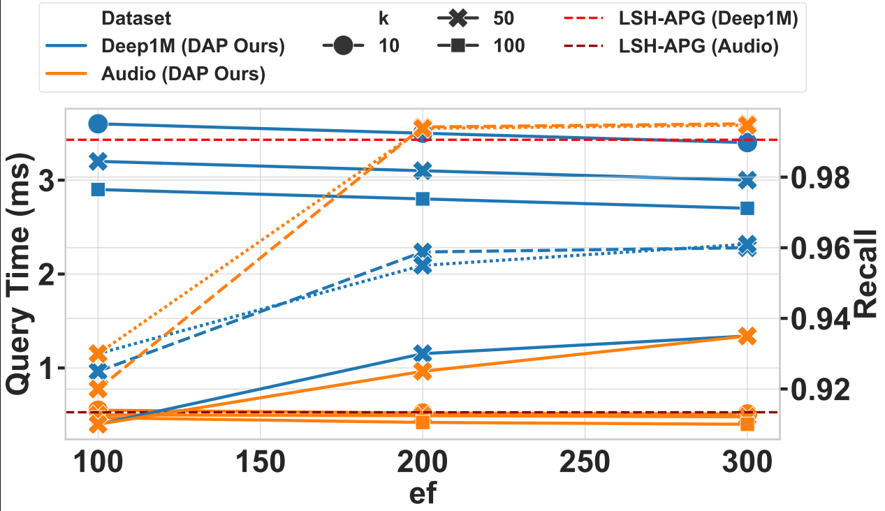
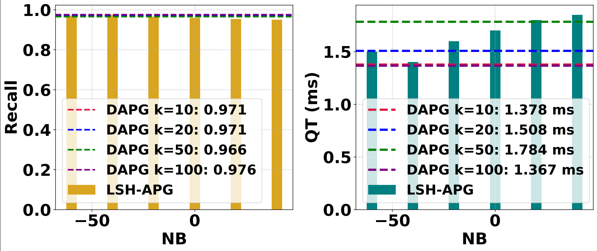
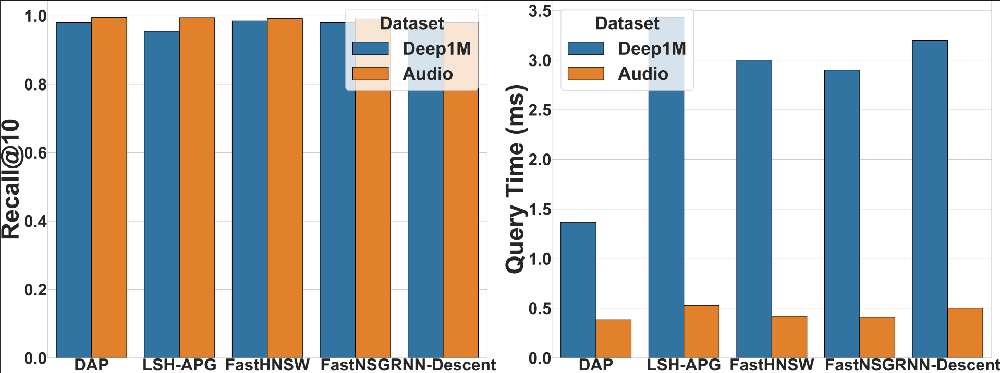

# DAPG: Distance-Aware Pruned Graph

> **Distance-Aware Pruning for Efficient Approximate Nearest Neighbor Search over Evolving Data**  
> 
---


<p align="center">
  <a href="https://students.washington.edu/solmazsm/"><strong>Solmaz Seyed Monir</strong></a>, 
  <a href="https://faculty.washington.edu/dzhao/"><strong>Dr. Dongfang Zhao</strong></a>,

</p>


<p align="center">
  <a href="https://solmazsm.github.io/Distance-Aware-Pruned-Graph/" target="_blank">
    
  </a>

  <a href="https://github.com/solmazsm/Distance-Aware-Pruned-Graph/">
    
  </a>
  
</p>  

<p align="center">
   <b>University of Washington</b>
</p>


---

## **ABSTRACT**

DAPG introduces percentile-based local filtering and adaptive global sparsification to build degree-adaptive proximity graphs that preserve reachability while reducing redundant edges.  
DAPG improves latency–recall trade-offs over **state-of-the-art (SOTA)** baselines without multi-layer indexing.

<p>
  <kbd>+3.3% recall</kbd>
  <kbd>2.9× faster</kbd>
  <kbd>Single layer</kbd>
  <kbd>LSH seeding</kbd>
</p>

---
## Why This Work

### What existing ANN methods miss and how **DAPG** addresses them

| Common gaps in existing ANN methods | How **DAPG** addresses them |
| :---------------------------------- | :--------------------------- |
| • **Fixed-degree graphs:** Static degree limits prevent density-aware sparsification. | **Adaptive sparsity:** Local percentile filtering and global capping balance recall and cost. |
| • **Costly rebuilds:** Traditional structures often require expensive repair or reconstruction under updates. | **Localized updates:** Insertions and deletions reapply pruning only to affected neighborhoods. |
| • **Uncontrolled expansion:** Greedy traversal may expand redundant nodes. | **Pruned search:** Traversal operates on a sparse, degree-controlled graph. |
| • **Weak theoretical support:** Prior heuristics often lack formal sparsity, query-cost, and recall-preservation analysis. | **Theory-backed design:** DAPG provides sparsity bounds, query-cost analysis, and conditional recall-preservation guarantees. |

> **Result:** DAPG improves the recall-latency trade-off, achieving up to **3.3% higher recall** and up to **2.9× lower query time**, while supporting localized update maintenance.

---
## Contributions

<table>
  <tr>
    <td width="48%" valign="top">

<strong>1) Theory</strong><br>
Formalizes distance-aware pruning and adaptive degree control in proximity graphs, providing sparsity bounds, query-cost analysis, update-cost analysis, and conditional recall-preservation guarantees.

  </td>
  <td width="48%" valign="top">

<strong>2) Method</strong><br>
DAPG introduces local percentile filtering (P<sub>local</sub>) and adaptive global capping (P<sub>global</sub>) to construct degree-adaptive graphs that reduce redundant edges while preserving neighborhood connectivity.

  </td>
  </tr>
  <tr>
  <td width="48%" valign="top">

<strong>3) Empirics</strong><br>
Evaluates DAPG on six datasets against representative static and update-aware ANN baselines, showing up to 3.3% higher recall and up to 2.9&times; lower query time.

  </td>
  <td width="48%" valign="top">

<strong>4) Updates</strong><br>
Supports localized insert/delete maintenance by reapplying pruning only to affected hash buckets, candidate neighborhoods, and adjacency lists, avoiding full-index reconstruction.

  </td>
  </tr>
</table>


## Introduction

This repository provides the source code for **DAPG**, a distance-aware pruned graph index for efficient Approximate Nearest Neighbor (ANN) search over evolving vector data.

---

## What DAPG Adds

**Distance-Aware Pruned Graph Framework**

- **Distance-aware local pruning:** Uses node-specific percentile thresholds to retain locally relevant neighbors.
- **Adaptive global sparsification:** Caps high-degree nodes to control graph density and reduce redundant edges.
- **LSH-seeded single-layer construction:** Builds a sparse proximity graph from hash-based candidate neighborhoods without hierarchical indexing.
- **Localized update maintenance:** Supports insertions and deletions by reapplying pruning only to affected hash buckets, candidate neighborhoods, and adjacency lists.
- **Theory-backed analysis:** Provides sparsity bounds, query-cost analysis, update-cost analysis, and conditional recall-preservation guarantees.

---

## Cost Model

DAPG combines local percentile pruning with an adaptive global cap <code>T'</code>. The expected query cost factorizes into the final average graph degree and the expected expansion depth needed to reach the query locality basin.

<pre>
C_Q = O(d̄_DAPG · β(ℓ))
T_Q = O(d · d̄_DAPG · β(ℓ))
d̄_DAPG ≤ min{p d̄_LSH, T′}
</pre>

**Cost model:** <code>C<sub>Q</sub> = O(d̄<sub>DAPG</sub> β(ℓ))</code>.

---


## Compilation

The code is implemented in **C++11** and supports parallelism using **OpenMP**. It can be compiled on both Linux and Windows.

### Linux

Linux (g++ / clang++)

Requires C++11 and OpenMP.

The provided Makefile auto-detects -fopenmp. If your toolchain differs, edit cppCode/DAPG/Makefile.

```bash
cd ./cppCode/DAPG
make
```

###  Windows

Use **Visual Studio 2019+** to import the project located in:

```
./cppCode/DAPG/src/
```

Make sure to enable OpenMP and C++11 support in the build settings.

## Running DAPG

### Command Format

```bash
./dapg datasetName
```

- `datasetName`: The name of the dataset (e.g., `sift`, `mnist`, `audio`)

### Example

```bash
cd ./cppCode/DAPG
./dapg sift
```

This runs DAPG index construction and search on the `sift` dataset.

## Key Features

- **Distance-aware local pruning:** Adapts edge retention using node-specific percentile thresholds.
- **Adaptive sparsification:** Controls high-degree nodes with a global cap while preserving neighborhood connectivity.
- **LSH-seeded construction:** Builds a single-layer proximity graph from hash-based candidate neighborhoods.
- **Localized updates:** Supports insertions and deletions without full-index reconstruction.
- **Recall-latency improvement:** Achieves up to **3.3% higher recall** and up to **2.9× lower query time**.

---

## Method Comparison

| Feature | HNSW | LSH-APG | DAPG |
|---|---|---|---|
| Graph structure | Multi-layer proximity graph | Single-layer LSH-assisted graph | Single-layer distance-aware pruned graph |
| Candidate generation | Graph-based traversal | LSH-assisted candidates | LSH-seeded candidate neighborhoods |
| Pruning rule | Heuristic neighbor selection | Fixed/global degree control | Node-local percentile threshold with global cap |
| Density adaptivity | Limited | Limited | High, through local distance thresholds |
| Degree control | `M`, `M_max` | Global caps | Local pruning + adaptive cap `T′` |
| Dynamic updates | Incremental insertion | Incremental maintenance | Localized insert/delete maintenance |
| Rebuild requirement | Not always, but repair can be costly | Avoids full rebuild in some settings | Avoids full-index reconstruction through local re-pruning |

---

## Complexity and Efficiency

DAPG reduces redundant edges by combining local percentile pruning with adaptive global sparsification. The expected query cost is:

<pre>
C_Q = O(d̄_DAPG · β(ℓ))
d̄_DAPG ≤ min{p d̄_LSH, T′}
</pre>

| Method | Build Complexity | Query Complexity | Notes |
|:---|:---:|:---:|:---|
| HNSW | Õ(n log n · d̄_HNSW) | O(d̄ β(ℓ)) | Multi-layer graph |
| LSH-APG | O(nd C_Q) + O(n d̄_LSH) | O(d̄_LSH β(ℓ)) | Fixed/global pruning |
| **DAPG** | O(nd C_Q) + O(nk log k) + O(n d̄_DAPG) | **O(d̄_DAPG β(ℓ))** | Local percentile pruning + adaptive cap |

**Key benefits:**

- Fewer redundant edges
- Lower traversal cost
- Single-layer graph structure
- Localized insert/delete maintenance
- Improved recall-latency trade-off
> ---
## EVALUATIONS

## Datasets

We support and have tested DAPG on:

- [Audio](https://github.com/RSIA-LIESMARS-WHU/LSHBOX-sample-data)
- [SIFT1M](http://corpus-texmex.irisa.fr/)
- [Deep1M](https://www.cse.cuhk.edu.hk/systems/hash/gqr/dataset/deep1M.tar.gz)
- [MNIST](http://yann.lecun.com/exdb/mnist/)
- [SIFT100M](http://corpus-texmex.irisa.fr/)
- [Text2Image1M](https://research.yandex.com/datasets)


Convert these into the `.data_new` format for compatibility.
## Dataset Format

The expected input format is a binary file containing float vectors, structured as:

```
{int: float size in bytes}
{int: number of vectors}
{int: dimension}
{float[]: all vector values, stored sequentially}
```

### Example: `sift.data_new`

To use your dataset:

1. Convert it into the binary format shown above.
2. Rename it as `[datasetName].data_new`
3. Place it in: `./dataset/`

A sample dataset (e.g., `audio.data_new`) is already provided.


## Dataset-Dependent Pruning Behavior

DAPG adapts each node’s pruning threshold `τᵢ` based on its local distance distribution. Compact, low-LID regions allow effective sparsification, while high-LID or heterogeneous regions require more conservative edge retention to preserve connectivity.

| Dataset | Geometry | LID | Pruning Behavior | Graph Size |
|---|---|---:|---|---|
| **Audio** | Uniform MFCC neighborhoods | 21.5 | Stable thresholds; consistent pruning | **Small** |
| **MNIST** | Clustered pixel manifold | 12.7 | Effective sparsification | **Small** |
| **Deep1M** | Heterogeneous cosine space | 26.0 | Conservative pruning | **Larger** |
| **SIFT1M** | Smooth L2 structure | 12.9 | Balanced pruning | **Medium** |
| **SIFT100M** | Large-scale smooth L2 structure | 23.7 | Effective pruning at scale | **Smaller** |
| **Text2Image1M** | Multimodal cosine space | 8.4† | Adaptive retention of cross-modal edges | **Medium/Larger** |

†The LID value for Text2Image1M is estimated on the available one-million-vector subset. 

## System Setup

Our experiments were conducted on both local and cloud-based environments to evaluate the efficiency and scalability of the DAPG system.

###  Local Workstation
- **Processor**: 13th Gen Intel® Core™ i9-13900HX (24 cores, 32 threads)
- **Base Frequency**: 2.2 GHz  
- **OS**: Ubuntu 20.04 LTS  
- **Precision**: `float32` for all vectors  
- **Implementation**: C++ with multi-threading via OpenMP  
- **Query Setup**: 104 queries per experiment, averaged over 5 independent runs

###  Microsoft Azure Virtual Machines

1. **Standard F32s v2**
   - **vCPUs**: 32  
   - **RAM**: 64 GiB  
   - **Dataset**: SIFT1M  
   - **Purpose**: Scalability evaluation

2. **Standard E64-32s v3 (High-Memory)**
   - **vCPUs**: 32 (Intel® Xeon® Platinum 8272CL)  
   - **RAM**: 432 GiB  
   - **Disk**: 1 TB Premium SSD  
   - **OS**: Ubuntu 22.04 LTS  
   - **Dataset**: SIFT100M  
   - **Purpose**: Large-scale indexing and ANN benchmarking

This high-memory configuration allowed for efficient scaling to large datasets, and multi-threaded execution ensured fast parallel processing during both index construction and query search.
 

#### Distance-Aware Pruning (DAP)
- Introduced a percentile-based thresholding mechanism.
- For each node, computed the 80th percentile distance (τ_q) over LSH candidates.
- Inserted only neighbors with `dist < τ_q` to ensure sparsity and relevance.
- Exposed `last_threshold` for optional diagnostics or debugging.


####  Parallel Construction
- Used `ParallelFor` to insert all nodes in parallel (except the first).
- Enabled thread safety via `std::shared_mutex` for concurrent graph updates.
- Fallbacks to `std::mutex` when C++17 is not available.

#### Serialization
- Graph (`linkLists`) and LSH hash tables are saved to and loaded from a binary format.
- Implemented in `save()` and the constructor `divGraph(Preprocess* prep, ...)`.

## Benchmark Logs

Each row logs detailed metrics:

- **Recall**: Top-k retrieval accuracy
- **Pruning**: Ratio of retained neighbors after DAP-based filtering
- **Time**, **Cost**, and additional performance indicators
- **Algorithm Name**: Includes pruning threshold information (e.g., `DAP_k10_th...`)


- The header includes configuration details such as:  
  `k=20, probQ=0.9, L=2, K=18, T=24`

Each row records:
- `algName`: algorithm configuration with pruning threshold
- `k`: number of neighbors
- `ef`: search parameter
- `Time`: average query time (ms)
- `Recall`: search recall
- `Cost`, `CPQ1`, `CPQ2`: computation cost metrics
- `Pruning`: pruning ratio applied

### Parameter Settings

We evaluate DAP (Distance-Aware Pruning) with:

- k=20, L=2, K=18, T=24, T′=48, W=1.0, pC=0.95, pQ=0.90, efC=80

  
**DAPG computes τ_q per node (default percentile = 80).**


DAP applies **local dynamic pruning**, computing a threshold `τ_q` per node.

---

We evaluate DAPG across a range of:

- `k ∈ {1, 10, 20, ..., 100}`
- `ef` values for query expansion

This allows robust analysis of recall and efficiency across diverse search settings

## Metrics
Each run logs:

Recall@k, Time(ms), Cost, CPQ*, Pruning(%)

algName encodes the pruning threshold (e.g., DAP_k10_th80)

Seed and environment are printed at the top for determinism.


## Results

### Performance Comparison with Reproduced LSH-APG

| Dataset | Method | Recall | Query Time (ms) | Index Size (MB) | Indexing Time (s) | Pruning Rate |
|---|---|---:|---:|---:|---:|---:|
| **DEEP1M** | LSH-APG | 0.9590 | 3.43 | 250 | 230.1 | 0.267 |
|  | **DAPG** | **0.9632** | **2.30** | 449 | **98.3–121.5** | **0.30–0.32** |
| **MNIST** | LSH-APG | 0.9972 | 0.682 | 10 | 6.4 | 0.410 |
|  | **DAPG** | **0.9984** | **0.560** | 27.77 | **3.2–4.5** | **0.50–0.53** |
| **SIFT1M** | LSH-APG | 0.9580 | 2.42 | 468 | 105 | 0.210 |
|  | **DAPG** | **0.9870** | **0.83** | **455** | **70–103** | **0.54–0.55** |

### Improvement over LSH-APG

| Dataset | Recall Improvement | Query-Time Improvement |
|---|---:|---:|
| DEEP1M | **+0.44%** | **32.9% lower** |
| MNIST | **+0.12%** | **17.9% lower** |
| SIFT1M | **+3.34%** | **65.6% lower** |

DAPG improves recall and reduces query time compared with reproduced LSH-APG across DEEP1M, MNIST, and SIFT1M. It also achieves higher pruning rates, indicating more effective distance-aware pruning.

- DAPG applies distance-aware pruning, producing more effective and sparser graphs.
- LSH-APG values are reported at `k = 50`.
- DAPG spans `k = 10–100`.
- The larger DAPG index size on MNIST is due to denser graph construction.
- DAPG results at `k = 10` include 12-run mean ± standard deviation.

Performance comparison of DAPG vs. LSH-APG on DEEP1M, MNIST, and SIFT1M.
DAPG continues to achieve higher recall and lower query latency than LSH-APG across all datasets, demonstrating consistent scalability and efficiency gains at larger neighborhood sizes.
<table>
<tr>
<td>

---

## Query Efficiency and Recall

DAPG improves the recall-latency trade-off over LSH-APG across neighborhood budgets and datasets. On **Deep1M**, DAPG achieves comparable or higher recall with lower query time than LSH-APG. On **Audio**, DAPG also reduces latency while preserving high recall.



[View PDF](docs/result/figures/query_time_and_recall_vs_ef.pdf)

---

## DAPG vs. LSH-APG Recall-Latency

DAPG consistently improves the recall-latency trade-off over LSH-APG across neighborhood budgets. The best trade-off occurs at **k = 10**, where DAPG reaches approximately **0.971 recall** with **1.378 ms** query time.



[View PDF](docs/result/figures/dap_vs_lshapg_comparison.pdf)

---

## DAPG vs. Baselines on Deep1M and Audio

DAPG achieves the highest Recall@10 and the lowest query time on **Deep1M** and **Audio**, showing that distance-aware pruning preserves high-quality neighbors while producing sparse, navigable proximity graphs.



[View PDF](docs/result/figures/dap_vs_baselines_deep1m_audio.pdf)


## Research Project Directory Structure

```
.
├── .vscode/                         # VS Code settings
│
├── Report/                          # Project report and documentation
│
├── cppCode/
├── DAPG/
│   └── Makefile                         # Build configuration
│   ├── src/                         # Distance-Aware Pruned Graph implementation
│   │   ├── indexes/                 # Precomputed/saved index statistics
│   │   │   ├── mnist_all_index_stats.txt
│   │   │   ├── audio_all_index_stats.txt
│   │   │
│   │   ├── divGraph.h               #Modified: Graph structure (updated Source files)
│   │   ├── dapgalg.h                
│   │   ├── Preprocess.h            
│   │   ├── Query.cpp               
│   │   ├── main.cpp                
│   │                
│   │
├── docs/
    └── result/
│       └── recall_vs_qt_sift100m.pdf
├── dataset/                         
├── .gitattributes
├── .gitignore
├── LICENSE
└── README.md
             
```
## Contact

For questions or contributions, please open an issue or contact the authors listed in the paper.


